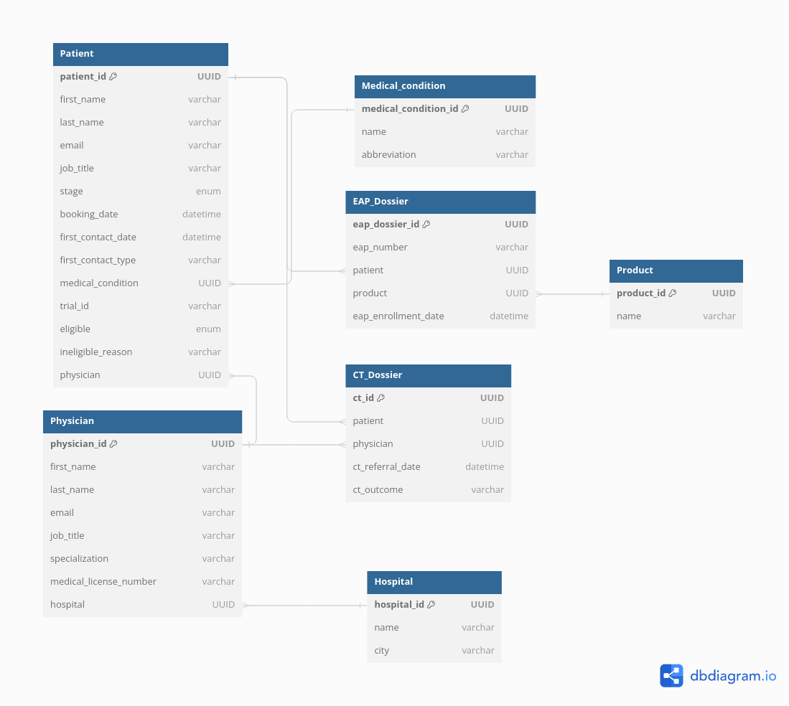

# mytomorrows-assignment

Solution for the MyTomorrows technical assignment.

Deployed API in AWS Lambda: [API Docs](https://chmse4i7yzrdgqxta7ptfomxyq0cxmun.lambda-url.eu-central-1.on.aws/docs)

## Database schema proposal



## Requirements

* Environment variables:
```
DATABASE_URL=<database_url>
```

## Setup and run locally

* Create the Python virtual environment:
  ```
  python -m venv venv
  source venv/bin/activate
  pip install -r requirements.txt
  ```

* Run the server:
  ```
  uvicorn api.main:app --reload
  ``` 

